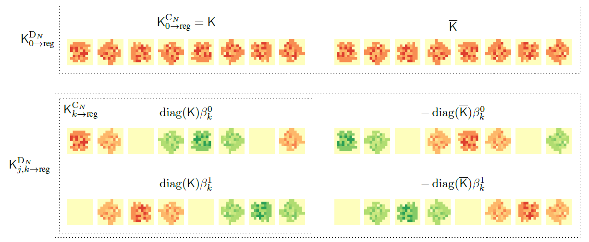

# FILTRA: Rethinking Steerable CNN by Filter Transform

[](https://github.com/prclibo/relative_pose/blob/master/LICENSE)
[](http://proceedings.mlr.press/v139/li21v/li21v.pdf)
[](https://arxiv.org/abs/2105.11636)




This repository hosts the code for the FILTRA steerable CNN proposed in our ICML 2021 paper:
```
@inproceedings{li2021filtra,
  title={FILTRA: Rethinking Steerable CNN by Filter Transform},
  author={Li, Bo and Wang, Qili and Lee, Gim Hee},
  booktitle={International Conference on Machine Learning},
  pages={6515--6522},
  year={2021},
  organization={PMLR}
}
```

The convolution module has three APIs which can be found in `filtra/conv.py`. See the docstring inside for detailed usage.

Usually, to implement a full CNN for classification, you need convolution layers, activation layers and pooling layers. I am just too lazy and busy to implement activation and pooling layers so I wrapped FILTRA conv in the interface of E2CNN and re-use their other layers. But this results in runtime overhead to transpose tensor to the E2CNN order. It should not be difficult to implement FILTRA style activation and pooling layers if you really need it. *I will hopefully implement a version if I got time by July or later*.


